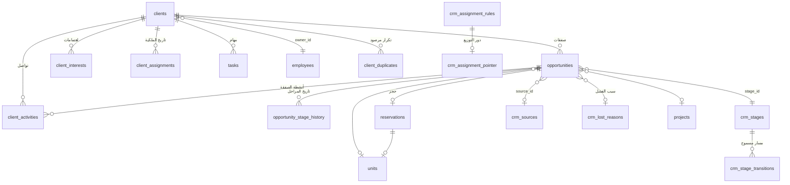

# معمارية الـCRM — من «جدول عملاء» إلى نظام تشغيل الإيراد

> وثيقة حيّة. تُحدَّث مع كل مرحلة تُنفَّذ.
> المرحلتان ١ و٢ (التدقيق والمعمارية) مكتملتان. طبقة القاعدة (070–080) **مُطبَّقة على القاعدة الحيّة في ٢٠٢٦-٠٩-٢٢** والواجهة مبنيّة. راجع §١٠ لما اكتُشف أثناء التشغيل.

---

## ١. خلاصة التدقيق (المرحلة ١)

### ما هو موجود فعلاً — وأنضج مما يبدو

| الطبقة | الحجم | التقييم |
|---|---|---|
| دوال القاعدة | ١٩٠+ | منطق الأعمال في القاعدة فعلاً، لا في React — مبدأ §70 مُطبَّق أصلاً |
| المحفّزات | ٨٥ | ترحيل محاسبي، حراسة، ختم، إشعارات |
| مهام مجدولة | ٥ | `crm-followup-scan`, `tasks-daily-reminder`, `auto-checkout`, `broker-lead-scan`, `reservation-expiry-scan` |
| سجلّ تدقيق | `audit_log` + `audit_row()` عام | جاهز للتوسعة — يُطبَّق حالياً على ٣ جداول فقط |
| الإشعارات | `notifications` | موجود، بسيط (`kind` نصّي، بلا أولوية ولا تصنيف) |
| المهام | `tasks` | **موجود بالفعل** ومربوط بالعميل — §17 لا يحتاج جدولاً جديداً، يحتاج توسعة |
| المحاسبة | قيد مزدوج كامل مع أقفال فترات | لا يُمَس |
| العمولات | محرّك بطبقتين + شرائح | لا يُمَس، يُربَط بالفرصة |

**الاستنتاج:** لا نحتاج إعادة بناء. نحتاج **إصلاح جذر واحد** ثم البناء فوقه.

### الجذر: نموذج الملكية قائم على النصّ

```
clients.sales_employee  text        ← اسم مكتوب بخطّ اليد
        ↓
public.name_key(نص)  ← تطبيع مسافات وحالة أحرف
        ↓
can_see_client()  →  RLS  →  من يرى العميل
buildTeam()       →  التقارير  →  أداء الموظف
client-followups  →  التنبيهات  →  من يُشعَر
```

كل شيء معلّق بخيط نصّي. النتائج المباشرة:

1. **`unmatched_sales_employees()` موجودة في 032 كدالة تشخيص** — اعتراف صريح بأن الاسم قد لا يقابل حساباً. هؤلاء العملاء لا يراهم إلا المدير، ولا يظهرون في أداء أحد.
2. **لا تاريخ للملكية.** تغيير `sales_employee` يستبدل النصّ بلا أثر. من كان يملك الليد قبل شهر؟ لا جواب.
3. **الإسناد الجماعي بلا حارس.** ٦٢ ليداً باسم موظفة واحدة، كلها «منذ ٥٠ يوم»، كلها مرحلة «اتصال» — نمط دفعة مستوردة أُسندت لحساب واحد ثم لم تُعمل. النظام اليوم يعرضها كـ«ضعف أداء» وهي في الحقيقة **خلل توزيع**.
4. **لا فرق بين الليد والفرصة.** `clients.stage` عمود واحد: العميل الذي اشترى شقة ويفاوض على ثانية لا يمكن تمثيله. عميل واحد = مرحلة واحدة = صفقة واحدة على الأكثر.

### القواعد المتصلّبة في الكود (hard-coded) — §71

| القاعدة | مكانها الآن |
|---|---|
| ٧ / ٢١ يوماً (ألوان الصمت) | `src/lib/types.ts::sinceColor` |
| ١٤ يوماً (مهمل) | `src/lib/crm-reports.ts::buildKpis` |
| المراحل الستّ | `types.ts::PIPELINE_STAGES` + `check` في القاعدة + قوائم Excel |
| ٩ صباحاً / ٢٤ ساعة تصعيد | `sql/027` نصّاً في `cron.schedule` |
| مصادر العملاء، طرق الدفع، الأغراض | `types.ts` ثوابت |
| احتمالات الإغلاق | غير موجودة أصلاً |

**المرحلة نصّ في عمودين مختلفين** (`clients.stage` و`client_activities.stage_to`) بلا مفتاح أجنبي — إعادة تسمية مرحلة اليوم تكسر التاريخ والتقارير معاً.

### ما يعمل جيداً ولا يُمَس

- قاعدة «لا تواصل بلا موعد متابعة» (028) وإبطالها عند الإغلاق (029) — انضباط حقيقي مفروض في القاعدة
- `baghdad_today()` — التوقيت المحلي مُعالَج بشكل صحيح في كل مكان
- مسار الاستيراد من خطوتين مع تحقّق صارم
- فصل `crm-reports.ts` كدوال خالصة — طبقة تقارير قابلة للاختبار موجودة أصلاً
- محرّك العمولة ومبدأ «تلال وسيط لا بائع» (056) — أساس مالي سليم

---

## ٢. القرار المعماري (المرحلة ٢)

### الخيار المُختار: (ب) معمارية جديدة بهجرة تدريجية — بلا كسر

الخيار (أ) «توسيع `clients`» مرفوض: يُبقي الملكية النصّية ولا يحلّ مشكلة العميل متعدّد الصفقات.
الخيار (ب) النقيّ «جدول leads جديد وهجرة كاملة» مرفوض أيضاً: يكسر ١٧ صفحة، وسياسات RLS، والاستيراد، والحجوزات، والعمولات دفعة واحدة.

**المُختار: توسيع `clients` كـ«جهة اتصال» + إنشاء `opportunities` كطبقة الصفقة فوقه.**

```
clients  ← يبقى كما هو (السجلّ الشخصي: من هو، كيف نصل إليه)
   │        + owner_id (مفتاح حقيقي، يعيش بجانب sales_employee لا بدلاً منه)
   │        + phone_key (رقم مطبّع للكشف عن التكرار)
   │        + lifecycle_stage (ليد / مؤهَّل / عميل / خامل)
   │
   ├──1:N──► opportunities        ← الصفقة: مشروع، وحدة، قيمة، مرحلة، احتمال
   │             ├──1:N──► opportunity_stage_history
   │             ├──1:N──► client_interests   (وحدات/مشاريع يهتم بها)
   │             └──1:1──► reservations       (الحجز القائم يُربَط بفرصته)
   │
   ├──1:N──► client_activities    ← موجود، يُوسَّع بـ opportunity_id
   ├──1:N──► tasks                ← موجود، يُوسَّع بـ opportunity_id + SLA
   ├──1:N──► client_assignments   ← تاريخ الملكية (جديد)
   └──1:N──► client_duplicates    ← التكرار المكتشَف (جديد)
```

### مبدأ عدم الكسر: القراءة المزدوجة (Dual-read)

لا عمود قديم يُحذف في هذه المرحلة. `sales_employee` يبقى نصّاً ويُحدَّث تلقائياً من `owner_id` بمحفّز، فتستمر كل شاشة وتقرير واستيراد يعمل بلا تعديل سطر واحد. الشاشات تُهاجَر إلى `owner_id` تدريجياً، وعند اكتمالها يُحذف النصّ في هجرة منفصلة.

```
owner_id (مصدر الحقيقة الجديد) ──محفّز──► sales_employee (نصّ، للتوافق فقط)
can_see_client():  owner_id = ملفّي  OR  name_key(sales_employee) = اسمي   ← الشرطان معاً
```

### المرحلة تصبح مفتاحاً لا نصّاً — بجسر توافق

`crm_stages` جدول يُبذَر بالمراحل الستّ الحالية **بنفس أسمائها حرفياً**. `opportunities.stage_id` مفتاح أجنبي، و`clients.stage` النصّي يبقى مرآةً محدَّثة بمحفّز. فتستمر لوحة الكانبان والتقارير والاستيراد على النصّ بينما يعمل المحرّك على المفتاح.

### طبقة التقارير: تعريف واحد لكل رقم (§53)

كل رقم يُحسب في **دالة قاعدة بيانات واحدة** تُستدعى من كل مكان. لا يُعاد حساب «معدّل التحويل» في صفحتين.

| المصطلح | التعريف الملزم |
|---|---|
| Lead | صفّ في `clients` غير محذوف، دورة حياته `ليد` أو `مؤهَّل` |
| Qualified Lead | ليد اجتاز بوابة التأهيل (ميزانية + اهتمام عقاري + إطار زمني) |
| Opportunity | صفّ في `opportunities` بمرحلة نوعها `open` |
| Won / Lost | فرصة بمرحلة نوعها `won` / `lost` — **لا العميل** |
| Pipeline Value | مجموع `expected_value` للفرص المفتوحة |
| Weighted Pipeline | مجموع `expected_value × probability` |
| Conversion Rate | فرص فائزة ÷ (فائزة + خاسرة) — المفتوحة خارج المقام |
| Sales Cycle | أيام من `created_at` للفرصة إلى `closed_at` |
| Revenue | **عمولة تلال لا ثمن الوحدة** — التزاماً بمبدأ 056 |

آخر سطر غير قابل للتفاوض: تقرير يعرض ٧٧ مليوناً كإيراد يكذب على الإدارة.

---

## ٣. خطة الهجرات

| # | العنوان | الحالة |
|---|---|---|
| 070 | مركز الإعدادات — المراحل، المصادر، أسباب الفشل، SLA، قواعد التقييم | ✅ مُطبَّقة ٢٠٢٦-٠٩-٢٢ |
| 071 | الهوية والملكية — تطبيع الهاتف، `owner_id`، تاريخ الإسناد، كشف التكرار | ✅ مُطبَّقة ٢٠٢٦-٠٩-٢٢ |
| 072 | الفرص — `opportunities`، تاريخ المراحل، الاهتمامات العقارية، ربط الحجز | ✅ مُطبَّقة ٢٠٢٦-٠٩-٢٢ |
| 073 | محرّك الإسناد وإعادة التوزيع | ✅ مُطبَّقة ٢٠٢٦-٠٩-٢٢ |
| 074 | التأهيل وتقييم الليد ودرجة الحرارة — بشرح لكل نقطة | ✅ مُطبَّقة ٢٠٢٦-٠٩-٢٢ |
| 075 | SLA والتصعيد بتاريخ | ✅ مُطبَّقة ٢٠٢٦-٠٩-٢٢ |
| 076 | طبقة التقارير — دوال التعريف الموحّد + اللقطات التاريخية | ✅ مُطبَّقة ٢٠٢٦-٠٩-٢٢ |
| 077 | جودة البيانات + الحذف الناعم + الدمج | ✅ مُطبَّقة ٢٠٢٦-٠٩-٢٢ |
| 078 | الأهداف والتنبؤ | ✅ مُطبَّقة ٢٠٢٦-٠٩-٢٢ |
| 079 | الحملات وإسناد المصدر (first/last touch) | ✅ مُطبَّقة ٢٠٢٦-٠٩-٢٢ |
| 080 | العروض المحفوظة · مطابقة الوحدات · الإجراء التالي · صحّة العميل | ✅ مُطبَّقة ٢٠٢٦-٠٩-٢٢ |

**طبقة القاعدة مُطبَّقة: ١١ هجرة + ٣ إصلاحات لاحقة (072b, 072c, 076b) مدمجة في الملفات.** أُعيد تشغيلها بالترتيب الرقمي؛ الملفات آمنة لإعادة التشغيل.

**قاعدة السلامة لكل هجرة:** آمنة لإعادة التشغيل · لا `drop column` · بذرة تُطابق السلوك الحالي حرفياً · تحقّق بعدي في نهاية الملف يطبع ما تغيّر.

### مخطط الكيانات بعد 070–073



### سلامة الحلقات في المرايا

مرآتان متقابلتان بين `clients.stage` و`opportunities.stage_id`. تتوقّف السلسلة لأن كلا الاتجاهين مشروط بـ `is distinct from`:

```
تغيّر مرحلة الفرصة → يحدّث العميل (إن اختلف) → يحاول تحديث الفرصة → القيمة نفسها → صفر صفوف → توقّف
تغيّر مرحلة العميل → يحدّث الفرصة (إن اختلفت) → يحاول تحديث العميل → القيمة نفسها → صفر صفوف → توقّف
```

والمرآة تعمل **فقط حين يملك العميل فرصة واحدة**. أكثر من فرصة: `clients.stage` يُترك كما هو.

---

## ٤. ما لا يُبنى (وسبب ذلك)

| مطلوب في الطلب | القرار |
|---|---|
| AI scoring / next best action | البنية تُجهَّز (§58)، والنموذج لا يُضاف الآن — تقييم بلا تاريخ كافٍ يكذب |
| Unit matching «ذكي» | مطابقة بقواعد صريحة (ميزانية/مساحة/مشروع) لا تعلّم آلي — قابلة للتفسير |
| `client_documents` | يحتاج Supabase Storage وسياسة احتفاظ — مرحلة لاحقة مستقلة |
| تكاملات Meta/Google/TikTok | تُبنى الواجهة (`crm_lead_intake`) لا الموصّلات — لا مفاتيح ولا عقود بعد |
| `client_notes` منفصل | `client_activities` بنوع «ملاحظة» يكفي — جدول ثالث يفتّت التسلسل الزمني |

---

## ٥. تشغيل الهجرات

تُشغَّل بالترتيب من محرّر SQL في Supabase (اصطلاح المشروع).
**لا تُشغَّل 071 قبل 070** — الثانية تستدعي `crm_setting_num()` و`is_open_stage()` المعرَّفتين في الأولى.

كل ملف ينتهي ببلوك تحقّق يطبع `NOTICE` و`WARNING`. اقرأ المخرجات قبل الانتقال للتالي:

| المخرَج | معناه |
|---|---|
| `مطابقة المراحل: سليمة` | 070 لم يغيّر سلوك `is_open_stage` — آمن |
| `مرحلة على عملاء وليست في crm_stages: «س»` | أضِف المرحلة قبل الاعتماد على الجدول |
| `الترحيل: كامل` | كل اسم «موظف مبيعات» قابَل ملفّ موظف |
| `بلا مالك رغم وجود اسم: ن` | يطبع الأسماء غير المطابقة — صحّحها أو أسنِد بـ `assign_client()` |
| `أعلى تركّز: «س» يملك ن ليداً مفتوحاً` | قياس خلل التوزيع مباشرةً من بياناتك |

### التراجع

لا يحذف أي ملف عموداً ولا بيانات. للتراجع عن 071 تُسقط المحفّزات الجديدة
(`trg_client_owner_sync`, `trg_log_client_assignment`, `trg_z_guard_client_owner`, `trg_audit_clients`)
وتعود السياسات بإعادة تشغيل `sql/043` قسم ٨. الأعمدة المضافة تبقى بلا ضرر.

---

## ٦. ما تبقّى من التطوير

### أ. قاعدة البيانات — ✅ اكتملت

إحدى عشرة هجرة، ٥٨٧٤ سطراً، ٣٢ جدولاً جديداً، ٦٠+ دالة، ٥ مهام مجدولة جديدة.
الباقي كله في الواجهة والاختبارات.

### ب. الواجهة — مبنيّة (١٦ شاشة/مكوّناً فوق `src/lib/crm.ts`)

المبدأ الحاكم: **لا حساب في الواجهة**. `src/lib/crm.ts` نقطة وصول واحدة تنقل ما تُرجعه دوال 070–080 كما هو، والأخطاء تُبتلع مع تسجيلها في سجلّ الخادم — فتعمل كل شاشة قبل تشغيل الهجرات (تعرض «غير متاح») وبعدها بلا تعديل.

| الشاشة | المسار | يقرأ من | الحالة |
|---|---|---|---|
| مساحة عمل الموظف | `/dashboard/crm/today` | `crm_unworked_leads`, `tasks`, `crm_lead_scores` | ✅ |
| لوحة الإدارة «نظرة» | `/dashboard/crm/overview` | `crm_kpis`, `crm_funnel`, `crm_distribution_alerts`, `crm_forecast`, `crm_data_quality`, `crm_sla_summary` | ✅ |
| الفرص (أعمدة + قائمة) | `/dashboard/crm/opportunities` | `v_crm_opportunities`, `crm_stages`, `crm_lost_reasons` | ✅ سبب الخسارة يُطلب قبل الإرسال |
| مركز التوزيع | `/dashboard/crm/distribution` | `crm_owner_load`, `redistribute_leads`, `assign_client` | ✅ |
| التقارير | `/dashboard/crm/reports` | دوال 076 + 079 + `crm_trend` + `crm_campaign_performance` | ✅ `crm-reports.ts` حُذف |
| التنبؤ والأهداف | `/dashboard/crm/forecast` | `crm_forecast`, `crm_forecast_by`, `crm_target_progress`, `sales_targets` | ✅ |
| جودة البيانات | `/dashboard/crm/data-quality` | `crm_data_quality`, `client_duplicates`, `merge_clients`, `scan_client_duplicates`, `crm_fix_whitespace` | ✅ دمج زوجاً زوجاً |
| إعدادات الـCRM | `/dashboard/settings/crm` | جداول 070 (settings, stages, sources, lost_reasons, score_rules) | ✅ المراحل لا يُعاد تسميتها |
| ملف العميل ٣٦٠ | `/dashboard/clients/[id]` | انظر أدناه | ✅ |
| قائمة العملاء | `/dashboard/clients` | + مُرشِّحات العنوان + `crm_saved_views` | ✅ |
| الإشعارات | `/dashboard/notifications` | أعمدة 075 (priority, category) | ✅ ترتيب بالأولوية وتصفية بالتصنيف |
| لوحة مدير المتابعة والمدير | `/dashboard` | `CrmAttention` (تنبيهات التوزيع، غير المُشتغَل، خروق الخدمة) | ✅ |

**ملف العميل ٣٦٠** يضيف فوق ما كان: رأس بالمالك (بالمفتاح) والحرارة والدرجة؛ `CrmInsights` (الإجراء التالي، الدرجة بأسبابها، صحّة العلاقة، الفرص، الوحدات المطابقة)؛ `QualificationPanel` (حقول 074 — وحفظها يعيد حساب الدرجة فوراً)؛ `NewOpportunity`؛ `InterestsPanel`؛ ربط التواصل بالفرصة في `LogActivity`؛ و`CrmHistory` (الملكية وتاريخ المراحل في تسلسل واحد).

**الثوابت خرجت من الكود (§71):** `src/lib/crm-config.ts::getPipelineConfig()` يقرأ المراحل وألوانها والمصادر وعتبات الصمت من القاعدة ويسقط إلى ثوابت `types.ts` حين تغيب الجداول. المستهلكون: `StageSelect`, `SalesBoard`, `ClientForm`, قائمة العملاء، صفحة العميل، قالب الاستيراد، والتحقّق في المعاينة والالتزام. الصفحات خارج الـCRM (الوسطاء، الفريق) ما زالت على الثوابت — تعمل، وتُهاجَر لاحقاً.

**الاستيراد (§48):** كشف التكرار بمفتاح الهاتف المطبّع (`phoneKey()` تطابق `normalize_iraqi_phone` حرفياً) في المعاينة **وفي الالتزام** — كان في المعاينة وحدها فيُلتفّ عليه بإعادة الإرسال.

### ج. ما لم يُبنَ بعد

| البند | السبب / الحالة |
|---|---|
| الاختبارات (§65) | لا إطار في المشروع. يحتاج قرار تأسيس: `vitest` للمنطق الخالص (`phoneKey`, `buildFollowUps`, `validateRow`) و`pgTAP` للسياسات والمحفّزات |
| الأدوار `marketing` / `finance` / `viewer` (§50) | غير موجودة في `UserRole` — إضافتها تمسّ `auth.ts` و`profiles` وكل السياسات؛ قرار منفصل |
| الإجراءات الجماعية (§47) | إعادة التوزيع الجماعي موجودة؛ تغيير مرحلة/وسم/مهمة جماعي لا |
| واجهة الحملات (إنشاء/تعديل) | جدول 079 موجود وتقريرها يُعرض؛ لا نموذج إدخال بعد |
| قواعد الإسناد التلقائي (واجهة) | `crm_assignment_rules` و`auto_assign_client` في 073 بلا شاشة ضبط |
| `client_documents` | يحتاج Supabase Storage وسياسة احتفاظ — مرحلة مستقلة |
| موصّلات Meta/Google/TikTok | البوابة `crm_lead_intake` جاهزة؛ لا مفاتيح ولا عقود |
| الصفحات خارج الـCRM على الثوابت | `broker/*`, `brokers/*`, `team`, `rm-dashboard` تقرأ `PIPELINE_STAGE_COLORS` و`sinceColor` بالافتراض القديم — تعمل، وتُهاجَر عند الحاجة |

### د. تقدير الحجم

| الطبقة | المُنجَز | المتبقّي |
|---|---|---|
| هجرات SQL | ١١ ملفاً · مُطبَّقة | — |
| واجهة | ≈ ٦٥٠٠ سطر TypeScript · ٣٥ ملفاً | الإجراءات الجماعية، نموذج الحملات، شاشة قواعد الإسناد |
| اختبارات | ٠ | تأسيس + ≈ ١٥٠٠ سطر |

### هـ. المهامّ المجدولة بعد اكتمال الطبقة

| المهمة | التوقيت (بغداد) | الملف |
|---|---|---|
| `crm-followup-scan` | ٩:٠٠ | 027 (قائمة) |
| `lead-score-refresh` | ٦:٠٠ | 074 |
| `crm-sla-scan` | ٨:٠٠ | 075 |
| `crm-daily-snapshot` | ٢٣:٠٠ | 076 |
| `crm-forecast-snapshot` | ٥:٠٠ أول كل شهر | 078 |

الترتيب مقصود: الدرجات تُحدَّث (٦) ← الخروق تُرصد (٨) ← المتابعات تُنبَّه (٩)،
فيرى الموظف صباحه مرتّباً بأحدث الأرقام. واللقطة في آخر اليوم بعد انتهاء العمل.

---

## ٧. مصفوفة الصلاحيات (§50) — كما تفرضها القاعدة

الواجهة تخفي الأزرار؛ القاعدة هي الحَكَم. المصدر: سياسات RLS في 071–080 ودوال `security definer` التي تفحص الدور بنفسها.

| الفعل | المدير | مدير المتابعة | المشرف | الموظف | الوسيط / مدير العلاقات |
|---|---|---|---|---|---|
| قراءة العملاء | الكل | الكل | نطاقه (`my_scope_employees`) | ما أنشأه أو يملكه (`owner_id` أو الاسم) | ليدات شركته |
| تعديل العميل | ✅ | ❌ (قراءة فقط) | نطاقه | ملكه | ليدات شركته |
| قراءة المحذوف ناعماً | ✅ وحده | ❌ | ❌ | ❌ | ❌ |
| الحذف الناعم / الاسترجاع | ✅ | ❌ | ❌ | ❌ | ❌ |
| الدمج (`merge_clients`) | ✅ وحده | ❌ | ❌ | ❌ | ❌ |
| الإسناد (`assign_client`) | ✅ | ✅ | داخل نطاقه فقط (من وإلى) | ❌ — لا ينقل ليداً لا إليه ولا منه | ❌ |
| إعادة التوزيع الجماعي | ✅ | ✅ | ❌ | ❌ | ❌ |
| قراءة الفرص | الكل | الكل | نطاقه | ما يراه من عملاء | — |
| فتح فرصة | ✅ | ✅ | على عملائه | على عملائه (`can_see_client`) | — |
| تعديل الفرصة / المرحلة | ✅ | ✅ | نطاقه | مالك الفرصة | — |
| حذف فرصة (ناعم) | ✅ | ❌ | ❌ | ❌ | — |
| الاهتمامات العقارية | ✅ | ✅ | نطاقه | على عملائه | — |
| قراءة التكرار | ✅ | ✅ | ❌ | ❌ | ❌ |
| قرار التكرار | ✅ وحده | ❌ | ❌ | ❌ | ❌ |
| التقارير الإجمالية (076) | ✅ | ✅ | ✅ (نطاقه عبر RLS — لا `security definer`) | أرقامه فقط بمُرشِّح نفسه | ❌ |
| اللقطات والاتجاهات | ✅ | ✅ | ✅ | ❌ | ❌ |
| الأهداف — كتابة | ✅ | ❌ | ❌ | ❌ | ❌ |
| الأهداف — قراءة | ✅ | ✅ | ✅ | هدفه | ❌ |
| خروق SLA — إغلاق | ✅ | ✅ | ما صُعّد إليه | ما يخصّه | ❌ |
| الحملات وبوابة الاستقبال — كتابة | ✅ | ❌ | ❌ | ❌ | ❌ |
| إعدادات الـCRM (070) | ✅ وحده | ❌ | ❌ | ❌ | ❌ |
| العروض المحفوظة | عروضه + المشترك | عروضه + المشترك | عروضه + المشترك | عروضه + المشترك | — |
| إعادة حساب الدرجات يدوياً | ✅ | ✅ | ✅ | ✅ لعميله | — |
| الاستيراد / التصدير | ✅ وحده | ❌ | ❌ | ❌ | ❌ |

ملاحظات:
- **مدير المتابعة يرى كل العملاء ولا يعدّلهم** (sql/040) — لكنه يُسند ويعيد التوزيع، لأن التشغيل اليومي واجبه والبيانات ليست ملكه.
- تاريخ الملكية (`client_assignments`) وتاريخ المراحل (`opportunity_stage_history`) **لا يُكتبان من الواجهة** — محفّزات تكتبهما، ولا سياسة كتابة عليهما لأي دور.
- الأدوار `marketing` / `finance` / `viewer` المطلوبة في §50 **غير موجودة بعد**. إضافتها تمسّ `auth.ts` و`profiles` وكل السياسات أعلاه — قرار مستقل.

## ٨. المهامّ المجدولة (§64)

| المهمة | التوقيت (بغداد) | cron (UTC) | الدالة | الملف |
|---|---|---|---|---|
| `lead-score-refresh` | ٦:٠٠ | `0 3 * * *` | `run_lead_score_refresh()` | 074 |
| `crm-sla-scan` | ٨:٠٠ | `0 5 * * *` | `run_crm_sla_scan()` | 075 |
| `crm-followup-scan` | ٩:٠٠ | `0 6 * * *` | `crm_followup_scan()` | 027 (قائمة) |
| `crm-daily-snapshot` | ٢٣:٠٠ | `0 20 * * *` | `take_crm_snapshot()` | 076 |
| `crm-forecast-snapshot` | ٥:٠٠ أول كل شهر | `0 2 1 * *` | `take_forecast_snapshot()` | 078 |

الترتيب مقصود: الدرجات تُحدَّث ← الخروق تُرصد ← المتابعات تُنبَّه، فيرى الموظف صباحه بأحدث الأرقام. والدوال الثلاث الأولى تُشغَّل يدوياً أيضاً من التقارير (زرّا «فحص المتابعات الآن» و«أعد حساب الدرجات») للإدارة.

## ٩. تعريفات التقارير الملزمة (§53)

كلها في دوال 076، وتُستدعى من `src/lib/crm.ts` بلا إعادة حساب:

| الرقم | الدالة | التعريف |
|---|---|---|
| Lead | `crm_kpis.leads` | صفّ `clients` غير محذوف أُنشئ في المدة |
| Opportunity | `crm_kpis.opportunities` | صفّ `opportunities` غير محذوف أُنشئ في المدة |
| Won / Lost | `won_count` / `lost_count` | فرصة أُغلقت في المدة بمرحلة نوعها `won` / `lost` |
| Conversion Rate | `conversion_rate` | `won ÷ (won + lost)` — المفتوحة خارج المقام |
| Pipeline Value | `pipeline_value` | مجموع `expected_value` للفرص المفتوحة |
| Weighted Pipeline | `weighted_pipeline` | مجموع `expected_value × probability / 100` |
| Sales Cycle | `avg_sales_cycle` / `median_sales_cycle` | أيام من `created_at` إلى `closed_at` للفائزة |
| Revenue | `won_value` | **عمولة تلال** لا ثمن الوحدة (056) |
| Commit | `crm_forecast.commit_value` | مفتوحة باحتمال ≥ ٧٠٪ وموعدها في الفترة |
| Best Case | `crm_forecast.best_case_value` | كل المفتوح في الفترة موزوناً |
| Neglected | `neglected_count` | مفتوح بلا تواصل ≥ `neglected_days` (إعداد) |
| Unworked | `crm_unworked_leads` | أُسنِد ولم يُسجَّل عليه تواصل خلال `unworked_lead_days` |

## ١٠. ما اكتشفه التشغيل الحيّ (٢٠٢٦-٠٩-٢٢)

الفحص البنيوي وحده لم يكفِ: ستّة أخطاء لم تظهر إلا بالتشغيل على القاعدة الحيّة، واحد منها كان سيكسر الحجز والكانبان معاً. كلها مُصلَحة في الملفات وفي القاعدة.

| # | الخطأ | الأثر لو لم يُكتشف | الإصلاح |
|---|---|---|---|
| ١ | `min(uuid)` غير موجودة في Postgres (071 `sync_client_owner`, 072 `mirror_client_stage_to_opportunity`) | **كل سحب بطاقة في الكانبان يفشل** | `(array_agg(id order by …))[1]` |
| ٢ | محفّز الحجز يُدخل نشاط «ملاحظة» بلا موعد متابعة، و`enforce_activity_followup` (028) يرفضه على عميل مفتوح | **كل حجز جديد على عميل مفتوح يفشل** | نوع نظامي «حجز» في `is_system_activity()` وفي `SYSTEM_ACTIVITY_TYPES` |
| ٣ | `public.teams` و`employees.team_id` غير موجودين — الفريق هو المشروع منذ 037 | 073 و075 و078 لا تُنشأ أصلاً | `projects` / `employees.project_id` / `my_supervised_projects()` |
| ٤ | `round(double precision, int)` غير موجودة — الوسيط في `crm_kpis` | 076 لا تُنشأ | `::numeric` قبل `round` |
| ٥ | القمع يحسب الخاسرة (ترتيب ٦) كأنها «وصلت» إلى «بيع» — ٣٣٠ وصلوا البيع والفائزون ٦ | تقرير يكذب في أول رقم | الخاسرة تصل حتى المرحلة التي خُسرت منها (من التاريخ) وإلا «ليد» |
| ٦ | فحص SLA الأول كان سيفتح ٢١٢ خرقاً قديماً بـ٢١٢ إشعاراً ثم ~١٥٠ تصعيداً للإدارة خلال ٣ أيام | إشعارات بلا مصداقية من اليوم الأول | `scan_crm_sla(p_notify := false)` خطّ أساس يُسجَّل بمستوى ٣ وسبب صريح + إشعار واحد للإدارة |

وثلاث ملاحظات على البيانات لا الكود:
- **٥٣ تكراراً مؤكّداً** (نفس الهاتف) بانتظار قرار الإدارة في الجودة، و٦١٢ مرشَّحاً بتشابه الاسم — عتبة ٠٫٤٥ سخيّة للعربية؛ ارفعها من الإعدادات إن أزعجت.
- **٩ أرقام أجنبية** (الإمارات، بريطانيا، أمريكا، قطر، الأردن) بلا `phone_key` لأن التطبيع عراقي بالتصميم؛ تظهر في الجودة كـ«لا تطابق الشكل العراقي». مفتاح E.164 للأجنبي تحسينٌ لاحق.
- **٣٢٤ خسارة بلا سبب** — مُرحَّلة من قبل 070؛ لا تُملأ بأثر رجعي. تحليل «لماذا نخسر» يبدأ من اليوم.

الأرقام الأولى على البيانات الحيّة: ٦٧٤ عميلاً ← ٦٧٤ فرصة (٣٤٤ مفتوحة · ٦ فائزة · ٣٢٤ خاسرة)، القمع ٦٧٤ ← ٣٢٥ ← ٤٥ ← ١٩ ← ٦، معدّل التحويل ١٫٨٪، ٦٢ مهملاً، ٤٥ لم يُعمل عليها، أعلى تركّز ٩٧ ليداً مفتوحاً عند موظفة واحدة (٢٨٪ — تحت عتبة التنبيه ٣٣٪).
