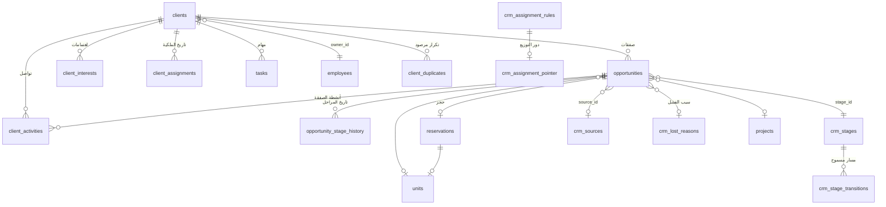

# معمارية الـCRM — من «جدول عملاء» إلى نظام تشغيل الإيراد

> وثيقة حيّة. تُحدَّث مع كل مرحلة تُنفَّذ.
> المرحلتان ١ و٢ (التدقيق والمعمارية) مكتملتان. التنفيذ يبدأ من الهجرة `070`.

---

## ١. خلاصة التدقيق (المرحلة ١)

### ما هو موجود فعلاً — وأنضج مما يبدو

| الطبقة | الحجم | التقييم |
|---|---|---|
| دوال القاعدة | ١٩٠+ | منطق الأعمال في القاعدة فعلاً، لا في React — مبدأ §70 مُطبَّق أصلاً |
| المحفّزات | ٨٥ | ترحيل محاسبي، حراسة، ختم، إشعارات |
| مهام مجدولة | ٥ | `crm-followup-scan`, `tasks-daily-reminder`, `auto-checkout`, `broker-lead-scan`, `reservation-expiry-scan` |
| سجلّ تدقيق | `audit_log` + `audit_row()` عام | جاهز للتوسعة — يُطبَّق حالياً على ٣ جداول فقط |
| الإشعارات | `notifications` | موجود، بسيط (`kind` نصّي، بلا أولوية ولا تصنيف) |
| المهام | `tasks` | **موجود بالفعل** ومربوط بالعميل — §17 لا يحتاج جدولاً جديداً، يحتاج توسعة |
| المحاسبة | قيد مزدوج كامل مع أقفال فترات | لا يُمَس |
| العمولات | محرّك بطبقتين + شرائح | لا يُمَس، يُربَط بالفرصة |

**الاستنتاج:** لا نحتاج إعادة بناء. نحتاج **إصلاح جذر واحد** ثم البناء فوقه.

### الجذر: نموذج الملكية قائم على النصّ

```
clients.sales_employee  text        ← اسم مكتوب بخطّ اليد
        ↓
public.name_key(نص)  ← تطبيع مسافات وحالة أحرف
        ↓
can_see_client()  →  RLS  →  من يرى العميل
buildTeam()       →  التقارير  →  أداء الموظف
client-followups  →  التنبيهات  →  من يُشعَر
```

كل شيء معلّق بخيط نصّي. النتائج المباشرة:

1. **`unmatched_sales_employees()` موجودة في 032 كدالة تشخيص** — اعتراف صريح بأن الاسم قد لا يقابل حساباً. هؤلاء العملاء لا يراهم إلا المدير، ولا يظهرون في أداء أحد.
2. **لا تاريخ للملكية.** تغيير `sales_employee` يستبدل النصّ بلا أثر. من كان يملك الليد قبل شهر؟ لا جواب.
3. **الإسناد الجماعي بلا حارس.** ٦٢ ليداً باسم موظفة واحدة، كلها «منذ ٥٠ يوم»، كلها مرحلة «اتصال» — نمط دفعة مستوردة أُسندت لحساب واحد ثم لم تُعمل. النظام اليوم يعرضها كـ«ضعف أداء» وهي في الحقيقة **خلل توزيع**.
4. **لا فرق بين الليد والفرصة.** `clients.stage` عمود واحد: العميل الذي اشترى شقة ويفاوض على ثانية لا يمكن تمثيله. عميل واحد = مرحلة واحدة = صفقة واحدة على الأكثر.

### القواعد المتصلّبة في الكود (hard-coded) — §71

| القاعدة | مكانها الآن |
|---|---|
| ٧ / ٢١ يوماً (ألوان الصمت) | `src/lib/types.ts::sinceColor` |
| ١٤ يوماً (مهمل) | `src/lib/crm-reports.ts::buildKpis` |
| المراحل الستّ | `types.ts::PIPELINE_STAGES` + `check` في القاعدة + قوائم Excel |
| ٩ صباحاً / ٢٤ ساعة تصعيد | `sql/027` نصّاً في `cron.schedule` |
| مصادر العملاء، طرق الدفع، الأغراض | `types.ts` ثوابت |
| احتمالات الإغلاق | غير موجودة أصلاً |

**المرحلة نصّ في عمودين مختلفين** (`clients.stage` و`client_activities.stage_to`) بلا مفتاح أجنبي — إعادة تسمية مرحلة اليوم تكسر التاريخ والتقارير معاً.

### ما يعمل جيداً ولا يُمَس

- قاعدة «لا تواصل بلا موعد متابعة» (028) وإبطالها عند الإغلاق (029) — انضباط حقيقي مفروض في القاعدة
- `baghdad_today()` — التوقيت المحلي مُعالَج بشكل صحيح في كل مكان
- مسار الاستيراد من خطوتين مع تحقّق صارم
- فصل `crm-reports.ts` كدوال خالصة — طبقة تقارير قابلة للاختبار موجودة أصلاً
- محرّك العمولة ومبدأ «تلال وسيط لا بائع» (056) — أساس مالي سليم

---

## ٢. القرار المعماري (المرحلة ٢)

### الخيار المُختار: (ب) معمارية جديدة بهجرة تدريجية — بلا كسر

الخيار (أ) «توسيع `clients`» مرفوض: يُبقي الملكية النصّية ولا يحلّ مشكلة العميل متعدّد الصفقات.
الخيار (ب) النقيّ «جدول leads جديد وهجرة كاملة» مرفوض أيضاً: يكسر ١٧ صفحة، وسياسات RLS، والاستيراد، والحجوزات، والعمولات دفعة واحدة.

**المُختار: توسيع `clients` كـ«جهة اتصال» + إنشاء `opportunities` كطبقة الصفقة فوقه.**

```
clients  ← يبقى كما هو (السجلّ الشخصي: من هو، كيف نصل إليه)
   │        + owner_id (مفتاح حقيقي، يعيش بجانب sales_employee لا بدلاً منه)
   │        + phone_key (رقم مطبّع للكشف عن التكرار)
   │        + lifecycle_stage (ليد / مؤهَّل / عميل / خامل)
   │
   ├──1:N──► opportunities        ← الصفقة: مشروع، وحدة، قيمة، مرحلة، احتمال
   │             ├──1:N──► opportunity_stage_history
   │             ├──1:N──► client_interests   (وحدات/مشاريع يهتم بها)
   │             └──1:1──► reservations       (الحجز القائم يُربَط بفرصته)
   │
   ├──1:N──► client_activities    ← موجود، يُوسَّع بـ opportunity_id
   ├──1:N──► tasks                ← موجود، يُوسَّع بـ opportunity_id + SLA
   ├──1:N──► client_assignments   ← تاريخ الملكية (جديد)
   └──1:N──► client_duplicates    ← التكرار المكتشَف (جديد)
```

### مبدأ عدم الكسر: القراءة المزدوجة (Dual-read)

لا عمود قديم يُحذف في هذه المرحلة. `sales_employee` يبقى نصّاً ويُحدَّث تلقائياً من `owner_id` بمحفّز، فتستمر كل شاشة وتقرير واستيراد يعمل بلا تعديل سطر واحد. الشاشات تُهاجَر إلى `owner_id` تدريجياً، وعند اكتمالها يُحذف النصّ في هجرة منفصلة.

```
owner_id (مصدر الحقيقة الجديد) ──محفّز──► sales_employee (نصّ، للتوافق فقط)
can_see_client():  owner_id = ملفّي  OR  name_key(sales_employee) = اسمي   ← الشرطان معاً
```

### المرحلة تصبح مفتاحاً لا نصّاً — بجسر توافق

`crm_stages` جدول يُبذَر بالمراحل الستّ الحالية **بنفس أسمائها حرفياً**. `opportunities.stage_id` مفتاح أجنبي، و`clients.stage` النصّي يبقى مرآةً محدَّثة بمحفّز. فتستمر لوحة الكانبان والتقارير والاستيراد على النصّ بينما يعمل المحرّك على المفتاح.

### طبقة التقارير: تعريف واحد لكل رقم (§53)

كل رقم يُحسب في **دالة قاعدة بيانات واحدة** تُستدعى من كل مكان. لا يُعاد حساب «معدّل التحويل» في صفحتين.

| المصطلح | التعريف الملزم |
|---|---|
| Lead | صفّ في `clients` غير محذوف، دورة حياته `ليد` أو `مؤهَّل` |
| Qualified Lead | ليد اجتاز بوابة التأهيل (ميزانية + اهتمام عقاري + إطار زمني) |
| Opportunity | صفّ في `opportunities` بمرحلة نوعها `open` |
| Won / Lost | فرصة بمرحلة نوعها `won` / `lost` — **لا العميل** |
| Pipeline Value | مجموع `expected_value` للفرص المفتوحة |
| Weighted Pipeline | مجموع `expected_value × probability` |
| Conversion Rate | فرص فائزة ÷ (فائزة + خاسرة) — المفتوحة خارج المقام |
| Sales Cycle | أيام من `created_at` للفرصة إلى `closed_at` |
| Revenue | **عمولة تلال لا ثمن الوحدة** — التزاماً بمبدأ 056 |

آخر سطر غير قابل للتفاوض: تقرير يعرض ٧٧ مليوناً كإيراد يكذب على الإدارة.

---

## ٣. خطة الهجرات

| # | العنوان | الحالة |
|---|---|---|
| 070 | مركز الإعدادات — المراحل، المصادر، أسباب الفشل، SLA، قواعد التقييم | ✅ مكتوبة — بانتظار التشغيل |
| 071 | الهوية والملكية — تطبيع الهاتف، `owner_id`، تاريخ الإسناد، كشف التكرار | ✅ مكتوبة — بانتظار التشغيل |
| 072 | الفرص — `opportunities`، تاريخ المراحل، الاهتمامات العقارية، ربط الحجز | ✅ مكتوبة — بانتظار التشغيل |
| 073 | محرّك الإسناد وإعادة التوزيع | ✅ مكتوبة — بانتظار التشغيل |
| 074 | التأهيل وتقييم الليد ودرجة الحرارة — بشرح لكل نقطة | ✅ مكتوبة — بانتظار التشغيل |
| 075 | SLA والتصعيد بتاريخ | ✅ مكتوبة — بانتظار التشغيل |
| 076 | طبقة التقارير — دوال التعريف الموحّد + اللقطات التاريخية | ✅ مكتوبة — بانتظار التشغيل |
| 077 | جودة البيانات + الحذف الناعم + الدمج | ✅ مكتوبة — بانتظار التشغيل |
| 078 | الأهداف والتنبؤ | ✅ مكتوبة — بانتظار التشغيل |
| 079 | الحملات وإسناد المصدر (first/last touch) | ✅ مكتوبة — بانتظار التشغيل |
| 080 | العروض المحفوظة · مطابقة الوحدات · الإجراء التالي · صحّة العميل | ✅ مكتوبة — بانتظار التشغيل |

**طبقة القاعدة اكتملت: ١١ هجرة، ٥٨٧٤ سطر SQL.** تُشغَّل بالترتيب الرقمي بلا استثناء.

**قاعدة السلامة لكل هجرة:** آمنة لإعادة التشغيل · لا `drop column` · بذرة تُطابق السلوك الحالي حرفياً · تحقّق بعدي في نهاية الملف يطبع ما تغيّر.

### مخطط الكيانات بعد 070–073



### سلامة الحلقات في المرايا

مرآتان متقابلتان بين `clients.stage` و`opportunities.stage_id`. تتوقّف السلسلة لأن كلا الاتجاهين مشروط بـ `is distinct from`:

```
تغيّر مرحلة الفرصة → يحدّث العميل (إن اختلف) → يحاول تحديث الفرصة → القيمة نفسها → صفر صفوف → توقّف
تغيّر مرحلة العميل → يحدّث الفرصة (إن اختلفت) → يحاول تحديث العميل → القيمة نفسها → صفر صفوف → توقّف
```

والمرآة تعمل **فقط حين يملك العميل فرصة واحدة**. أكثر من فرصة: `clients.stage` يُترك كما هو.

---

## ٤. ما لا يُبنى (وسبب ذلك)

| مطلوب في الطلب | القرار |
|---|---|
| AI scoring / next best action | البنية تُجهَّز (§58)، والنموذج لا يُضاف الآن — تقييم بلا تاريخ كافٍ يكذب |
| Unit matching «ذكي» | مطابقة بقواعد صريحة (ميزانية/مساحة/مشروع) لا تعلّم آلي — قابلة للتفسير |
| `client_documents` | يحتاج Supabase Storage وسياسة احتفاظ — مرحلة لاحقة مستقلة |
| تكاملات Meta/Google/TikTok | تُبنى الواجهة (`crm_lead_intake`) لا الموصّلات — لا مفاتيح ولا عقود بعد |
| `client_notes` منفصل | `client_activities` بنوع «ملاحظة» يكفي — جدول ثالث يفتّت التسلسل الزمني |

---

## ٥. تشغيل الهجرات

تُشغَّل بالترتيب من محرّر SQL في Supabase (اصطلاح المشروع).
**لا تُشغَّل 071 قبل 070** — الثانية تستدعي `crm_setting_num()` و`is_open_stage()` المعرَّفتين في الأولى.

كل ملف ينتهي ببلوك تحقّق يطبع `NOTICE` و`WARNING`. اقرأ المخرجات قبل الانتقال للتالي:

| المخرَج | معناه |
|---|---|
| `مطابقة المراحل: سليمة` | 070 لم يغيّر سلوك `is_open_stage` — آمن |
| `مرحلة على عملاء وليست في crm_stages: «س»` | أضِف المرحلة قبل الاعتماد على الجدول |
| `الترحيل: كامل` | كل اسم «موظف مبيعات» قابَل ملفّ موظف |
| `بلا مالك رغم وجود اسم: ن` | يطبع الأسماء غير المطابقة — صحّحها أو أسنِد بـ `assign_client()` |
| `أعلى تركّز: «س» يملك ن ليداً مفتوحاً` | قياس خلل التوزيع مباشرةً من بياناتك |

### التراجع

لا يحذف أي ملف عموداً ولا بيانات. للتراجع عن 071 تُسقط المحفّزات الجديدة
(`trg_client_owner_sync`, `trg_log_client_assignment`, `trg_z_guard_client_owner`, `trg_audit_clients`)
وتعود السياسات بإعادة تشغيل `sql/043` قسم ٨. الأعمدة المضافة تبقى بلا ضرر.

---

## ٦. ما تبقّى من التطوير

### أ. قاعدة البيانات — ✅ اكتملت

إحدى عشرة هجرة، ٥٨٧٤ سطراً، ٣٢ جدولاً جديداً، ٦٠+ دالة، ٥ مهام مجدولة جديدة.
الباقي كله في الواجهة والاختبارات.

### ب. الواجهة — لا شيء منها بُني بعد

طبقة القاعدة كاملة لكن **لم يُكتب سطر TypeScript واحد**. المطلوب:

| الشاشة | المسار المقترح | يقرأ من |
|---|---|---|
| مساحة عمل الموظف اليومية | `/dashboard/crm/today` | `crm_unworked_leads`, `tasks`, `crm_lead_scores` |
| لوحة الإدارة | `/dashboard/crm/overview` | `crm_kpis`, `crm_funnel`, `crm_distribution_alerts` |
| الفرص (قائمة + كانبان) | `/dashboard/crm/opportunities` | `v_crm_opportunities` |
| ملف العميل ٣٦٠ | `/dashboard/clients/[id]` — إعادة بناء بتبويبات | الفرص، الاهتمامات، التسلسل، الدرجة |
| مركز توزيع الليدات | `/dashboard/crm/distribution` | `crm_owner_load`, `redistribute_leads` |
| التقارير | `/dashboard/crm/reports` — إعادة بناء | دوال 076 بدل `crm-reports.ts` |
| التنبؤ والأهداف | `/dashboard/crm/forecast` | 078 |
| جودة البيانات والتكرار | `/dashboard/crm/data-quality` | 077 |
| إعدادات الـCRM | `/dashboard/settings/crm` | جداول 070 |

وعلى مستوى الكود:

- `src/lib/crm-reports.ts` (٣٢٣ سطراً) **يُستبدَل بالكامل** بمناداة دوال 076 — وإلا بقي تعريفان للرقم الواحد وعاد التناقض الذي عالجناه.
- `src/lib/types.ts`: `PIPELINE_STAGES` و`PIPELINE_STAGE_COLORS` و`sinceColor` تُقرأ من `crm_stages` و`crm_settings` بدل الثوابت.
- `src/lib/clients-excel.ts`: قوائم التحقّق تُقرأ من `crm_sources` بدل الثوابت، ويُضاف كشف التكرار قبل `commit`.
- مكوّنات جديدة: بطاقة الدرجة بأسبابها، شريط الحرارة، جدول الفرص، التسلسل الموحّد، المُرشِّحات المشتركة، الحفظ المُسمّى للمُرشِّحات (§46).

### ج. ما لم يُبدأ أصلاً

- **الاختبارات** (§65): لا إطار اختبار في المشروع اليوم — لا `jest` ولا `vitest` ولا `pgTAP` في `package.json`. يحتاج قراراً وتأسيساً قبل كتابة أي اختبار.
- **صلاحيات الأدوار الجديدة**: `marketing` و`viewer` و`finance` المذكورة في المتطلّبات غير موجودة في `UserRole` — إضافتها تمسّ `auth.ts` و`profiles` وكل السياسات.
- **الإجراءات الجماعية** (§47) والاستيراد المُحسَّن (§48) والمستندات (`client_documents`).

### د. تقدير الحجم

| الطبقة | المُنجَز | المتبقّي |
|---|---|---|
| هجرات SQL | ١١ ملفاً · ٥٨٧٤ سطر | — |
| واجهة (صفحات + مكوّنات + مكتبات) | ٠ | ≈ ٨٠٠٠–١٠٠٠٠ سطر TypeScript |
| اختبارات | ٠ | تأسيس + ≈ ١٥٠٠ سطر |

### هـ. المهامّ المجدولة بعد اكتمال الطبقة

| المهمة | التوقيت (بغداد) | الملف |
|---|---|---|
| `crm-followup-scan` | ٩:٠٠ | 027 (قائمة) |
| `lead-score-refresh` | ٦:٠٠ | 074 |
| `crm-sla-scan` | ٨:٠٠ | 075 |
| `crm-daily-snapshot` | ٢٣:٠٠ | 076 |
| `crm-forecast-snapshot` | ٥:٠٠ أول كل شهر | 078 |

الترتيب مقصود: الدرجات تُحدَّث (٦) ← الخروق تُرصد (٨) ← المتابعات تُنبَّه (٩)،
فيرى الموظف صباحه مرتّباً بأحدث الأرقام. واللقطة في آخر اليوم بعد انتهاء العمل.
