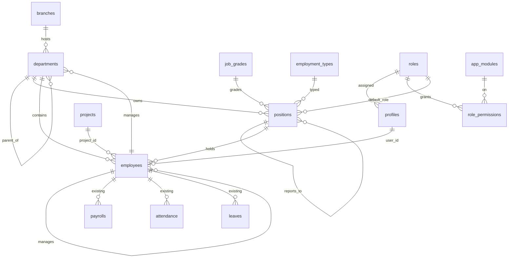

# HR المؤسسي — التحليل والخطة المرحلية

> مكمّل لـ [HR_ARCHITECTURE.md](HR_ARCHITECTURE.md) (وصف الموجود). هذا الملف: الفجوة بين الموجود والمطلوب، والتصميم المقترح، وخطة التنفيذ.
> مأخوذ من القاعدة الحيّة يوم **2026-10-05** (`pg_get_functiondef`, `pg_policies`, `pg_trigger`, `cron.job`)، لا من ملفات الهجرة وحدها.

---

## ١. تحليل البنية الحالية

**النمط الحاكم** (يبقى كما هو):
- Next.js (App Router) + Supabase. كل رقم مالي في دالة SQL `security definer`، والواجهة تعرض وتطلب.
- الصلاحيات **دورٌ واحد** في `profiles.role` (نص عليه CHECK بعشر قيم)، وتُقرأ بدوالّ `is_admin()`, `is_hr()`, `can_manage_hr()`…، وعليها تُبنى **كل** سياسات RLS (~400 سياسة).
- النطاق (من يرى من) **بالمشروع**: `employees.project_id` + `projects.supervisor_id` ← `my_scope_employees()`. لا أقسام، ولا مدير مباشر.
- التسويق أضاف «دوراً ثانياً» بالعلاقة لا بالدور: `mkt_team.mkt_role` ← `my_mkt_role()`. ومدير العلاقات علاقةٌ في `broker_company_projects.rm_id`.
- السجلّ: `audit_row()` على 59 جدولاً، والقراءة للمدير وحده.

**ما يعني ذلك للتوسعة:** كل وحدة جديدة تُبنى بجانب الموجود وتقرأ منه. لا إعادة كتابة لسياسات قائمة في هذه المرحلة؛ الانتقال إلى مصفوفة الصلاحيات يتم وحدةً وحدة، مع اختبار لكل وحدة.

### ملاحظات من البيانات الحيّة (تحتاج قراراً أو تصحيحاً)

| # | الملاحظة | الأثر |
|---|---|---|
| D1 | `employees.department` نصّ حرّ: «مبيعات» و«المبيعات»، «تسويق» و«التسويق»، و«ادارة» | لا يمكن التجميع ولا الصلاحية بالقسم. **يُعالج في المرحلة 1** |
| D2 | مدير الشركة مسجَّل قسمُه «التسويق» | يُصحَّح تلقائياً بربطه بمنصب «المدير العام» |
| D3 | موظفة مسمّاها «موظف مبيعات» ودورها `supervisor` وتشرف على مشروعين | المسمّى لا يطابق الواقع — يراجعه المالك من شاشة الموظف |
| D4 | «مدير تسويق» بدور `employee` و`mkt_team` **فارغ** | لا تدخل قسم التسويق إطلاقاً. تُضاف إلى فريق التسويق من قسم التسويق |
| D5 | `profiles` بلا سجلّ تدقيق — تغيير الدور لا يُسجَّل | **يُعالج في المرحلة 1** |
| D6 | `current_user_role()` تقرأ `profiles.is_active` غير الموجود، وتستعملها سياسات الجداول القديمة (`properties`, `deals`, `lease_contracts`, `lease_payments`, `activities`) | تلك الجداول ترفض كل وصول. خارج نطاق HR — يُقرَّر لاحقاً: حذف أم إصلاح |
| D7 | cron `leave-monthly-accrual` في القاعدة وليس في أي ملف `sql/` | يوثَّق في هجرة المرحلة 4 |

---

## ٢. وحدات HR الحالية

الموظف · الدوام بالموقع والانصراف التلقائي · استثناءات الدوام · محرّك خصم الدوام (مطفأ) · الإجازات وأرصدتها · السلف وأقساطها · العمولات (من تأكيد المقدمة) · الاستقطاعات اليدوية (ومدير المتابعة) · كشف الراتب بنوداً ودورة اعتماده وفصل الواجبات · الدفع الجزئي ومن جيب شريك · الاستقطاعات القانونية (مطفأة) · إغلاق الشهر · إنهاء الخدمة والتسليم · إعادة التفعيل · تاريخ الراتب · سجلّ التدقيق. التفاصيل في `HR_ARCHITECTURE.md`.

## ٣. الجداول الحالية ذات الصلة

`employees`, `profiles`, `projects`, `employee_salary_history`, `attendance`, `attendance_exemptions`, `work_locations`, `company_settings`, `leaves`, `leave_types`, `leave_entitlements`, `leave_ledger`, `employee_advances`, `advance_installments`, `commissions`, `employee_commission_rules`, `commission_plans` (+`commission_plan_tiers`، للوسطاء حالياً), `sale_commissions`, `deductions`, `payrolls`, `payroll_lines`, `payroll_payments`, `payroll_tax_brackets`, `employee_targets` (فارغ، للمبيعات فقط), `sales_targets` (أهداف CRM), `employee_handovers`, `notifications`, `audit_log`, `tasks`, `mkt_team`, `mkt_tasks`, `mkt_approvals` + `mkt_approval_rules` (موافقات تسويق بحدّ مبلغ), `inventory_items` (لوازم مكتب).

**غير موجود:** أقسام، فروع، مناصب، درجات وظيفية، أدوار قابلة للإدارة، مصفوفة صلاحيات، مدير مباشر، مراكز كلفة، مستندات الموظف، توظيف، تهيئة، تقييم أداء، عمل إضافي، مصروفات الموظف، عهد، محرّك موافقات عام.

## ٤. الدوالّ الحالية (النسخة الحيّة)

| المجموعة | الدوالّ |
|---|---|
| الهوية والدور | `my_role`, `is_admin`, `is_hr`, `is_accountant`, `is_supervisor`, `is_followup_manager`, `is_rm`, `is_broker`, `is_marketing`, `is_viewer`, `can_manage_hr`, `can_manage_finance`, `can_see_payroll`, `my_employee_id`, `my_account_active`, `my_mkt_role`, `is_marketing_manager` |
| النطاق | `my_supervised_projects`, `my_project_ids`, `my_scope_employees`, `my_scope_users`, `my_scope_projects` |
| الراتب | `salary_at`, `service_window`, `build_payroll` (آخر تعريف 119), `attendance_deductions`, `unpaid_leave_deductions`, `due_advance_installments`, `statutory_deductions`, `approve_payroll`, `reopen_payroll`, `lock_payroll`, `delete_payroll`, `repost_payroll`, `refresh_payroll_status`, `add/remove/update_payroll_line`, `update_payroll_period`, `build_all_payrolls`, `approve_all_payrolls`, `month_close_overview`, `payroll_reconciliation` |
| دورة الموظف | `handover_employee(emp, successor, p_end_date)`, `reactivate_employee`, `log_salary_change` (محفّز) |
| الإجازات والسلف | `normalize_leave`, `sync_leave_ledger`, `guard_leave_request`, `leave_balance`, `accrue_monthly_leave`, `approve/disburse/cancel_advance` |
| العمولات | `attach_commission_to_draft`, `set_sale_employee`, ومحرّك 129 (`commission_plans`) |

## ٥. RLS الحالية (HR)

| الجدول | المدير | hr | المحاسب | المشرف | الموظف |
|---|---|---|---|---|---|
| `employees` | الكل | الكل | قراءة | — | نفسه |
| `payrolls`/`payroll_lines` | الكل | الكل | قراءة | — | نفسه |
| `attendance`, `leaves` | الكل | الكل | — | فريقه (مشروعه) | نفسه + إدخال |
| `deductions` | الكل | الكل | قراءة | — | نفسه؛ مدير المتابعة يُدخل |
| `employee_salary_history`, `employee_targets`, `employee_advances` | الكل | الكل | قراءة | — | نفسه |
| `profiles` | تعديل | — | — | — | الجميع يقرأ (البريد والدور) |
| `audit_log` | قراءة | — | — | — | — |

الرواتب محميّة بالـRLS على مستوى الصف، ولا يوجد اليوم مَن يرى الموظفين **بلا** رواتبهم. فمدير قسمٍ يُعطى صلاحية على `employees` يرى الرواتب. **الحلّ في التصميم:** دوالّ `security definer` تُرجع الحقول غير المالية فقط (`department_members`).

## ٦. الأدوار الحالية

`admin`, `accountant`, `hr`, `supervisor`, `followup_manager`, `relationship_manager`, `broker`, `marketing`, `viewer`, `employee` — قائمة ثابتة في CHECK وفي `src/lib/auth.ts`. التوزيع الحيّ: 2 مدير · 3 مشرف · 10 موظف · 5 وسيط. **لا أحد بدور hr أو accountant بعد.**

---

## ٧. المكوّنات الناقصة — القرار لكل عنصر

| العنصر | القرار | السبب |
|---|---|---|
| `employees` | **ALTER** | يبقى الملف المركزي. يُضاف: `employee_code`, `department_id`, `position_id`, `manager_id`, `branch_id`, `employment_type`. لا جدول `staff` |
| `employees.department` / `job_title` (نص) | **DEPRECATE (يبقى مشتقاً)** | تقرؤه شاشات قائمة و`mkt_people()`. محفّز يملؤه من القسم/المنصب، فلا يُكسر شيء ولا يتباعد |
| `employees.project_id` | **REUSE** | عليه نطاق المشرف كلّه. التوزيع على عدة مشاريع جدولٌ إضافي (المرحلة 5) لا بديل |
| `profiles.role` | **REUSE كـ«مستوى أمني»** | كل RLS قائمة عليه. الدور القابل للإدارة (`roles`) يحمل `base_role` ويُشتق منه `profiles.role` تلقائياً |
| أدوار ومصفوفة صلاحيات | **ADD** `roles`, `app_modules`, `role_permissions` + `has_permission()` | تُطبَّق فوراً على الوحدات الجديدة، وتنتقل إليها القديمة وحدةً وحدة |
| أقسام/فروع/مناصب/درجات | **ADD** `departments`, `branches`, `positions`, `job_grades`, `employment_types` | غير موجودة |
| `employee_targets` | **ALTER (المرحلة 6)** | يُعمَّم بمؤشر (`kpi_id`) وقيمة وفعلي — لا جدول أهداف ثانٍ |
| `sales_targets` | **REUSE** | أهداف CRM؛ تقرأ منها مؤشرات المبيعات كمصدر «فعلي» |
| `notifications` | **REUSE** | مركز الإشعارات الموحّد هو نفسه، تُضاف أنواع |
| `audit_log` + `audit_row()` | **REUSE** | يُعلَّق على كل جدول جديد وعلى `profiles` |
| `mkt_approvals` | **REUSE كنمط، ثم REFACTOR (المرحلة 4)** | محرّك الموافقات العام يأخذ منه فكرة حدّ المبلغ، ويُبقيه يعمل للتسويق |
| `commission_plans` (129) | **EXTEND (المرحلة 5)** | محرّك عام فعلاً (`recipient_type`). يُضاف نوع «موظف» بقسم/منصب — لا محرّك ثانٍ |
| `employee_commission_rules` | **REUSE** | قواعد عمولة البيع الحالية؛ لا تُلمس |
| `build_payroll` | **REFACTOR (المرحلة 5)** | حماية البنود اليدوية/المعدّلة (`origin`: نظام/يدوي/معدَّل/مقفل) |
| `employee_advances` | **EXTEND (المرحلة 7)** | `kind`: سلفة راتب/قرض/طارئة/عهدة |
| `inventory_items` | **REUSE (المرحلة 7)** | عهد الموظف تُسجَّل على الأصناف الموجودة |
| `handover_employee` | **EXTEND (المرحلة 3/7)** | قائمة إخلاء طرف وتسوية نهائية قبله، لا بدله |
| `current_user_role()` | **خارج النطاق** | انظر D6 |

---

## ٨. البنية المقترحة

```
                   ┌──────────── roles ──── role_permissions ── app_modules
profiles(role*) ───┤ role_code → base_role يشتق profiles.role (توافق RLS القديمة)
   │
employees ─┬─ department_id ─► departments (شجرة: إدارة/قسم فرعي/فريق) ─► branches
           ├─ position_id ───► positions ─► job_grades (نطاق الراتب)
           ├─ manager_id ────► employees (خط التبعية)
           ├─ project_id ────► projects (نطاق المشرف — كما هو)
           └─ … كل الوحدات الحالية تبقى معلّقة بـ employee_id
```

**ثلاث طبقات للصلاحية:**
1. **المستوى الأمني** (`profiles.role`) — يحكم RLS القائمة. لا يتغيّر سلوكها.
2. **الدور** (`roles` + `role_permissions`) — وحدة × فعل × نطاق (`own`/`team`/`department`/`all`). يحكم الوحدات الجديدة عبر `has_permission()` و`permission_scope()`.
3. **العلاقة التنظيمية** — `manager_id` وإدارة القسم: `my_team_employee_ids()`, `my_managed_department_ids()`. تحدّد «فريقه» و«قسمه» للنطاق.

**حماية الحقول المالية:** الجداول التي فيها رواتب تبقى محميّة بالصف. ومن يحتاج رؤية ناس قسمه بلا رواتبهم يقرأ من دالة تُرجع الحقول غير المالية فقط.

## ٩. ERD (المرحلة 1 + الامتداد المخطّط)



المراحل التالية تضيف حول `employees`: `employee_documents`, `employee_events` (الخط الزمني), `job_requisitions`/`candidates`/`applications`/`offers`, `onboarding_tasks`, `probation_reviews`, `approval_flows`/`approval_steps`/`approval_requests`, `overtime_requests`, `shifts`, `attendance_requests`, `kpis`/`performance_reviews`, `employee_expenses`, `employee_assets`, `cost_centers`, `employee_project_allocations`, `clearance_items`.

## ١٠. مصفوفة الصلاحيات (البذرة)

النطاق بين قوسين. ✓ = كل الأفعال الأساسية (إنشاء/قراءة/تعديل/حذف). «مُطبَّق» = يُفرض الآن في القاعدة؛ غيره **موثّق** يطابق الواقع الحالي ويُفرض عند ترحيل وحدته.

| الوحدة | مُطبَّق | المدير العام | مدير HR | موظف HR | المدير المالي/محاسب | مدير تسويق | مدير مبيعات | موظف |
|---|---|---|---|---|---|---|---|---|
| الهيكل التنظيمي | ✅ | إدارة (all) | إدارة (all) | قراءة | قراءة | قراءة | قراءة | قراءة |
| الأدوار والصلاحيات | ✅ | إدارة | — | — | — | — | — | — |
| الموظفون | ⏳ | ✓ + راتب + شخصي | ✓ + راتب + شخصي (all) | ✓ + شخصي (all) | قراءة + راتب (all) | قراءة (department) | قراءة (team) | قراءة (own) |
| الدوام والإجازات | ⏳ | ✓ | ✓ + اعتماد | ✓ | — | اعتماد (department) | اعتماد (team) | إنشاء/قراءة (own) |
| الرواتب | ⏳ | ✓ + اعتماد | إعداد، **بلا اعتماد** | إعداد | قراءة + اعتماد + مالي | — | — | قراءة (own) |
| المحاسبة | ⏳ | ✓ | — | — | ✓ + اعتماد | — | — | — |
| التسويق | ⏳ | ✓ | — | — | قراءة مالي | إدارة (department) | — | — |
| CRM/المبيعات | ⏳ | ✓ | — | — | قراءة مالي | قراءة | ✓ (team) | ✓ (own) |

المصفوفة الكاملة بذرةٌ في `sql/146` وتُحرَّر من `/dashboard/settings/roles`.

## ١١. مصفوفة الموافقات (المرحلة 4 — المحرّك العام)

| الطلب | المستوى 1 | المستوى 2 | المستوى 3 | شرط |
|---|---|---|---|---|
| إجازة سنوية | المدير المباشر | HR | — | |
| إجازة بلا راتب / > 5 أيام | المدير المباشر | HR | المدير العام | قابل للإعداد |
| عمل إضافي | المدير المباشر | HR | — | |
| تعديل بصمة | المدير المباشر | HR | — | |
| مصروف | المدير المباشر | المالية | — | > حدّ مبلغ ← المدير العام |
| سلفة / قرض | المدير المباشر | HR | المالية (صرف) | |
| طلب توظيف | مدير القسم | HR | المدير العام | |
| زيادة راتب / ترقية | المدير المباشر | HR | المدير العام | |
| ميزانية حملة | (`mkt_approvals` كما هي) | | | |

**قواعد ثابتة في المحرّك:** لا أحد يوافق على طلبه؛ المستوى الذي لا مُوافِق له يُصعَّد لا يُتخطّى؛ كل قرار في سجلّ.

## ١٢. خريطة التكامل

| من HR | إلى | الرابط |
|---|---|---|
| الموظف | المستخدمون | `employees.user_id` ↔ `profiles` ↔ `roles` |
| القسم/المنصب | الصلاحيات | `positions.default_role_code` (يُقترح عند التعيين — المرحلة 9) |
| الموظف | CRM/المبيعات | `clients.sales_employee` (بالاسم — كما هو)، `opportunities`, `reservations`, `sale_commissions` |
| الموظف | الوساطة | `broker_company_projects.rm_id` |
| الموظف | التسويق | `mkt_team`, `mkt_tasks`, `mkt_activity_staff` |
| الموظف | المشاريع | `project_id` (+ التوزيع النسبي — المرحلة 5) |
| الرواتب/العمولات/السلف | المحاسبة | قيود 5100/2300/5500/1360 الحالية؛ ربط الحسابات قابل للإعداد (المرحلة 5) |
| كل حدث | الإشعارات | `notifications` |
| كل تغيير حسّاس | التدقيق | `audit_row()` |

---

## ١٣. خطة الهجرات

| المرحلة | الهجرات | المحتوى |
|---|---|---|
| **1** | **145** الهيكل · **146** الأدوار والصلاحيات · **147** الاختبارات | فروع، أقسام (شجرة)، درجات، أنواع توظيف، مناصب، أعمدة الموظف، ترحيل النصوص، أدوار، وحدات، مصفوفة، `has_permission`, تعيين الدور بدالة، تدقيق `profiles` |
| **2** | **148** الملف الكامل · **149** الاختبارات | البيانات الشخصية والطوارئ والتجربة والبنك، الحالة الوظيفية بآلة حالات بجانب status، تاريخ الراتب الموسّع + adjust_salary، المستندات بدلو خاصّ وتنبيه انتهاء (cron)، الخط الزمني من الجداول وسجلّ التدقيق، update_my_profile |
| **3** | **150** التوظيف · **151** التهيئة والتجربة · **152** الاختبارات | طلب (مدير القسم ← HR ← الإدارة) ← وظيفة ← مرشح ← مقابلة بتقييم ← عرض (يعتمده المدير) ← hire_candidate؛ قائمة تهيئة تلقائية بإنجاز ذاتي لما تتحقّق منه القاعدة؛ تقييم التجربة (مدير + HR) وقرار التثبيت/التمديد/الإنهاء وتنبيه قبل النهاية |
| **4** | **153** محرّك الموافقات · **154** الورديات وطلبات الدوام والعمل الإضافي · **155** سياسات الإجازات وسيرها · **156** الاختبارات | سلاسل قابلة للإعداد بأنواع مُوافِق وشروط وتصعيد؛ الإجازة والدوام والعمل الإضافي عبرها؛ الوردية تحكم الخصم والانصراف التلقائي؛ ترحيل الرصيد والإجازة التعويضية؛ توثيق cron الاستحقاق |
| **5** | **157** محرّك الكشف والتعويضات · **158** ربط الحسابات والكلفة والقسيمة · **159** الاختبارات | أصل البند (نظام/يدوي/معدَّل) وإعادة بناء لا تمسّ اليدوي؛ البدلات والمكافآت (بسلسلة) والإضافي وصرف الرصيد في الكشف؛ رافع الطلب لا يوافق عليه؛ ربط حسابات قابل للإعداد بقيم الأرقام القديمة؛ مراكز الكلفة والتوزيع على المشاريع؛ قسيمة الراتب |
| **6** | **160** الأداء والأهداف · **161** الاختبارات | كتالوج مؤشرات لكل قسم بمصدر فعليّه (CRM من crm_report_query، المهام، الدوام، التوظيف، يدوي)؛ employee_targets مُطوَّر لموظف/قسم/مشروع بإنجاز محسوب؛ مراجعات ذاتي ← مدير ← HR بأوزان قابلة للإعداد |
| **7** | **162** المصروفات والعهد · **163** إنهاء الخدمة · **164** الاختبارات | مصروفات بإيصال وسلسلة (المدير ← المالية) وقيد استحقاق ودفع؛ أنواع السلف؛ العهد؛ طلب إنهاء بسلسلة، إخلاء طرف بتحقّق تلقائي، تسوية نهائية (مكافأة نهاية الخدمة بقاعدة المالك)، وإكمال يرفض قبل الإخلاء |
| 8 | 171–173 | تقارير HR وتحليل الكلفة (قسم/مشروع/موظف) |
| 9 | 174–175 | محفّزات التكامل (تعيين ← دور، نقل ← نطاق، إنهاء ← إيقاف) + ترحيل سياسات RLS القديمة إلى المصفوفة وحدةً وحدة |
| 10 | 176 | تدقيق أمني شامل واختبارات كل دور |

**لكل هجرة:** مراجعة كاملة ← فحص الكائنات المرجعية على الحيّ ← تطبيق ← `tests.run_*()` ← RLS بانتحال أدوار ← الواجهة (`tsc` + `vitest`) ← دفع. لا تُدفع شاشة قبل هجرتها.

## ١٤. خطة التنفيذ — المرحلة 1 (الحالية)

**القاعدة (145–146):**
1. `branches` + فرع «المقر الرئيسي».
2. `departments` شجرة (`parent_id`, `unit_type`: إدارة/قسم فرعي/فريق، `manager_id`, `branch_id`, `status`: نشط/مؤرشف) — محفّزات: منع الحلقة، منع أرشفة قسمٍ فيه موظفون نشطون أو أقسام/مناصب نشطة.
3. `job_grades` (نطاق الراتب — قراءة HR/المالية فقط)، `employment_types`.
4. `positions` (القسم، الدرجة، المنصب الأعلى، نوع التوظيف، الدور الافتراضي، خطة العمولة، الوصف والمسؤوليات، الملاك المعتمد).
5. `employees` + `employee_code` (تلقائي `EMP-0001`) + القسم/المنصب/المدير/الفرع/نوع التوظيف. محفّز يملأ النصّين القديمين ويمنع حلقة الإدارة.
6. ترحيل: بذرة الهيكل والمناصب، وربط الموظفين الـ14 بمناصبهم من المسمّى، وأقسامهم من المنصب، ومديرهم المباشر من مشرف مشروعهم.
7. `roles` (16 دوراً + الأدوار النظامية العشرة)، `app_modules`، `role_permissions`، `profiles.role_code` مع اشتقاق `profiles.role`، `assign_user_role()`، `has_permission()`، `permission_scope()`، تدقيق `profiles`.
8. دوالّ النطاق: `department_tree()`, `department_members()`, `my_managed_department_ids()`, `my_team_employee_ids()`.

**الواجهة:** الهيكل التنظيمي (شجرة + إنشاء/تعديل/أرشفة)، صفحة القسم (لوحة القسم)، المناصب والدرجات، الأدوار ومصفوفة الصلاحيات، اختيار القسم/المنصب/المدير في نموذج الموظف، تعيين الدور من جدول الأدوار.

**الاختبار (147):** `tests.run_org()` — السلامة البنيوية، الترحيل، الحرّاس، RLS لكل دور (الموظف لا يكتب، HR لا يدير الأدوار، المدير لا يغيّر دوره، مدير القسم يرى ناسه بلا رواتب ولا يرى غيرهم، المحاسب لا يعدّل الهيكل)، والتوافق (RLS القديمة ترى `profiles.role` كما كان).
